<p align="center">
  
</p>

<h1 align="center">EDOPro HD Sync</h1>

<p align="center">
  
  
  
  
  
</p>

<p align="center">
  A fast, automatic HD artwork downloader for <a href="https://github.com/edo9300/edopro">EDOPro</a>.
  It scans your card databases, finds missing images, and downloads the best available artwork,
  including GOAT, Pre-Errata, and alternate art variants.
</p>

<p align="center">
  <a href="https://github.com/cntrl-alt-lenny/EDOPro-HD-Sync/releases/latest">
    
  </a>
</p>

<p align="center">
  <a href="https://github.com/cntrl-alt-lenny/EDOPro-HD-Sync/releases">
    
  </a>
</p>

## Why It Feels Better

- **Tick-box launcher** - the packaged app opens a small options window on Windows, macOS, and Linux: pick field art, only-my-decks, textures, repair, or a full refresh, then press Start
- **Every card type covered** - official, Rush Duel, and anime/custom cards are all fetched directly by ID
- **Field Spell playmat art** - downloads the cropped artwork EDOPro displays on the board into `pics/field/`
- **Self-updating launchers** - one double-clickable file per platform that installs new versions automatically
- **Offline health check** - quickly verifies suffix-stripping logic
- **Simple packaged releases** - ready-to-use downloads for Windows, macOS, and Linux
- **Curated textures** - optionally fetch a hand-picked set of backgrounds and card sleeves

## Quick Start

### Windows

1. Download the single `EDOPro-HD-Sync.bat` from [Releases](https://github.com/cntrl-alt-lenny/EDOPro-HD-Sync/releases/latest)
2. Double-click it
3. Pick your EDOPro folder when prompted — it remembers your choice

It downloads the app and your HD artwork, then runs. If SmartScreen warns, click **More info → Run anyway**. The full `EDOPro-HD-Sync-Windows-vVERSION.zip` bundle (with a `ReadMe.txt`) is also available.

### macOS

1. Download the single `EDOPro-HD-Sync.command` file from [Releases](https://github.com/cntrl-alt-lenny/EDOPro-HD-Sync/releases/latest)
2. Double-click it
3. The first time, pick your ProjectIgnis folder (the dialog starts in Applications) — it remembers your choice
4. If macOS asks the first time, **right-click the file and choose Open** (no System Settings trip needed)

It downloads the app and your HD artwork, then runs. The full `EDOPro-HD-Sync-macOS-vVERSION.zip` bundle (with a Mac `ReadMe.txt`) is also available if you prefer it.

### Linux

1. Download the single `EDOPro-HD-Sync.sh` from [Releases](https://github.com/cntrl-alt-lenny/EDOPro-HD-Sync/releases/latest)
2. Run `./EDOPro-HD-Sync.sh` (or double-click and choose "Run")
3. Pick your ProjectIgnis folder when prompted — it remembers your choice

It downloads the app and your HD artwork, then runs (the folder picker needs `zenity` or `kdialog`). The full `EDOPro-HD-Sync-Linux-vVERSION.zip` bundle (with a `ReadMe.txt`) is also available.

### From Source

```bash
pip install -r requirements.txt
python main.py --force
python main.py --health-check
```

## How It Works

Scans all `.cdb` card databases in your EDOPro folder and tries each card's ID directly on [YGOProDeck](https://ygoprodeck.com) — official, Rush Duel, and anime/custom cards are all hosted there under the same IDs EDOPro uses.

- **Field Spells** - the playmat (cropped) artwork is fetched into `pics/field/` automatically
- **Alternate artworks** - each art ID is tried individually
- **GOAT format cards** - matched to their official artwork by stripping the GOAT suffix
- **Pre-Errata cards** - resolved via suffix stripping, with a small ID-offset fallback for legacy edge cases
- **Manual overrides** - optional `manual_map.json` for edge cases

## Helpful Commands

- `python main.py --health-check` runs an offline sanity check for suffix-stripping and Pre-Errata matching
- `python main.py --stats` shows artwork coverage and disk usage without downloading anything
- `python main.py --my-decks` only syncs cards used in your EDOPro deck folder (much faster)
- `python main.py --gui` opens the tick-box options window (the packaged app does this automatically; `--no-gui` skips it)
- `python main.py --dry-run` previews what would be downloaded
- `python main.py --repair` re-downloads any images in `pics/` (and `pics/field/`) that are corrupt or incomplete
- `python main.py --no-field-art` skips the Field Spell playmat artwork
- `python main.py --textures` also downloads the curated texture pack (custom backgrounds and card sleeves) into `textures/` (the packaged app asks about this too)
- `python main.py --textures-pack NAME` picks a specific texture pack when more than one is available
- `python main.py --edopro-path "/path/to/ProjectIgnis"` points the tool at a specific folder

### Managed or proxied environments

The downloader honors the standard `HTTP_PROXY`, `HTTPS_PROXY`, and `NO_PROXY`
environment variables. It keeps certificate verification enabled using the
bundled `certifi` roots by default. If your network uses a private certificate
authority, point `EDOPRO_CA_BUNDLE` at its PEM bundle; it will be added to the
bundled roots before running the sync:

```bash
export EDOPRO_CA_BUNDLE="/path/to/company-or-managed-ca.pem"
python main.py --edopro-path "/path/to/ProjectIgnis"
```

## Contributing

Contributions are welcome! Please open an issue or submit a pull request.

## Credits

- Original concept: [EDOPro-Hd-Downloader](https://github.com/NiiMiyo/EDOPro-Hd-Downloader) by NiiMiyo
- Licensed under the [MIT License](LICENSE)
