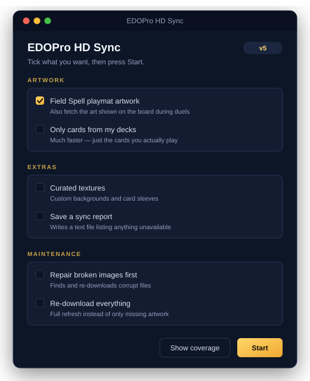

<p align="center">
  
</p>

<h1 align="center">EDOPro HD Sync</h1>

<p align="center"><b>Every card in HD. One double-click.</b></p>

<p align="center">
  
  
  
  
  
</p>

<p align="center">
  A fast, automatic HD artwork downloader for <a href="https://github.com/edo9300/edopro">EDOPro</a>.
  It scans your card databases, finds every missing image, and fetches the best available artwork —
  official, Rush Duel, anime/custom, GOAT, Pre-Errata, and alternate arts included.
</p>

<p align="center">
  
</p>

## Download

One download per platform on the [Releases page](https://github.com/cntrl-alt-lenny/EDOPro-HD-Sync/releases/latest). Every zip holds **one file and a ReadMe** — no install, no Python, no setup, nothing left behind on your machine.

| Platform | Download | Then |
|---|---|---|
| **Windows** | [`EDOPro-HD-Sync-Windows.zip`](https://github.com/cntrl-alt-lenny/EDOPro-HD-Sync/releases/latest) | Unzip, double-click **EDOPro-HD-Sync.exe**. If SmartScreen warns, choose **More info → Run anyway**. |
| **macOS** | [`EDOPro-HD-Sync-macOS.zip`](https://github.com/cntrl-alt-lenny/EDOPro-HD-Sync/releases/latest) | Unzip, double-click **EDOPro HD Sync** (the first time: **right-click → Open**). |
| **Linux** | [`EDOPro-HD-Sync-Linux.zip`](https://github.com/cntrl-alt-lenny/EDOPro-HD-Sync/releases/latest) | Unzip, double-click **EDOPro-HD-Sync** (or run `./EDOPro-HD-Sync`). |

**It finds your EDOPro folder for you.** The window opens showing the folder it found — press Start to use it, or **Change…** to pick a different one. If nothing turns up, you're asked to choose it straight away.

## Features

- **One file, nothing to install** — the download is a single app plus a ReadMe. Put it anywhere, delete it when you're done, and nothing is left behind.
- **Finds your EDOPro folder** — it checks the usual install locations and shows you what it found; you just confirm it.
- **One simple window** — tick what you want, press Start, and watch the live progress and results right in the window. Same experience on Windows, macOS, and Linux.
- **Every card type covered** — official, Rush Duel, and anime/custom cards are all fetched directly by the same IDs EDOPro uses.
- **Field Spell playmat art** — the cropped artwork EDOPro displays on the board is downloaded into `pics/field/` automatically.
- **Deck-first sync** — tick *Only cards from my decks* (or use `--my-decks`) and a fresh install is playable in minutes instead of hours.
- **Coverage at a glance** — the *Show coverage* button (or `--stats`) tells you how complete your artwork is without downloading a thing.
- **Repair mode** — tick *Repair broken images* (or use `--repair`) to find and re-fetch corrupt or half-downloaded files.
- **Curated textures** — optionally grab a hand-picked set of backgrounds and card sleeves.
- **Update notices** — it tells you when a newer version is out; download it and replace the one file.
- **Safe and resumable** — verified downloads, a 14-day failure cache so known-missing cards aren't hammered, and optional timestamped sync reports.

## How it works

0. **Find** — looks for your EDOPro folder in the places it's normally installed, then shows it for you to confirm.
1. **Scan** — reads every `.cdb` card database in your EDOPro folder (root, `expansions/`, and repository deltas).
2. **Diff** — compares the card list against the images already in `pics/` and only queues what's missing.
3. **Fetch** — 50 async workers try each card on [YGOProDeck](https://ygoprodeck.com), with a waterfall for tricky cases: manual overrides, GOAT / Pre-Errata suffix matching, an ID-offset fallback, and ProjectIgnis's own image server as the final backup (so even brand-new Rush Duel sets download).
4. **Extras** — Field Spell playmat art lands in `pics/field/`, definitive misses are cached for 14 days, and a sync report can be saved when it's done.

## CLI reference

The packaged app needs no flags — the options window covers the common choices. Power users get the full set:

<details>
<summary><b>All flags</b></summary>

| Flag | What it does |
|---|---|
| `--force` / `--no-force` | Re-download **all** images for a full refresh (default: only missing). |
| `--dry-run` | Preview what would be downloaded without downloading. |
| `--my-decks` | Only sync cards used in your EDOPro deck folder (much faster). |
| `--deck PATH` | Only sync cards in one `.ydk` file (repeat to combine decks). |
| `--decks-folder PATH` | Only sync cards in every `.ydk` inside a folder. |
| `--stats` | Show artwork coverage and disk usage, then exit. |
| `--repair` | Re-download images that are missing, corrupt, or not valid JPEGs. |
| `--field-art` / `--no-field-art` | Field Spell playmat art into `pics/field/` (default: on). |
| `--textures` / `--no-textures` | Also download the curated texture pack into `textures/`. |
| `--textures-pack NAME` | Pick a specific texture pack. |
| `--gui` / `--no-gui` | Force or skip the tick-box options window. |
| `--recheck-missing` | Retry cards in the failure cache (useful after new sets hit YGOProDeck). |
| `--prune` | After the sync, delete images whose IDs are no longer in any database. |
| `--edopro-path PATH` | Point at a specific EDOPro/ProjectIgnis folder. |
| `--save-report` / `--no-save-report` | Write a timestamped `.txt` sync report. |
| `--quiet` | Minimal output — just the progress bar and summary. |
| `--concurrency N` | Max simultaneous downloads (default: 50). |
| `--max-retries N` | Retry failed downloads N times (default: 3). |
| `--timeout N` | HTTP timeout in seconds (default: 30). |
| `--config PATH` | Use a custom config file. |
| `--generate-config` | Write a default `config.json` and exit. |
| `--health-check` | Run quick offline sanity checks and exit. |
| `--no-pause` | Windows packaged builds: close immediately instead of waiting for Enter. |

</details>

## From source

```bash
git clone https://github.com/cntrl-alt-lenny/EDOPro-HD-Sync.git
cd EDOPro-HD-Sync
pip install -r requirements.txt

python main.py                 # normal sync
python main.py --my-decks      # deck-first sync
python main.py --health-check  # quick offline sanity check
```

## Contributing

Contributions are welcome — open an issue or send a pull request. Please run `python main.py --health-check` and the test suite before submitting.

## Credits

- Original concept: [EDOPro-Hd-Downloader](https://github.com/NiiMiyo/EDOPro-Hd-Downloader) by NiiMiyo
- Card artwork hosted by [YGOProDeck](https://ygoprodeck.com) and [ProjectIgnis](https://github.com/ProjectIgnis)
- Licensed under the [MIT License](LICENSE)
